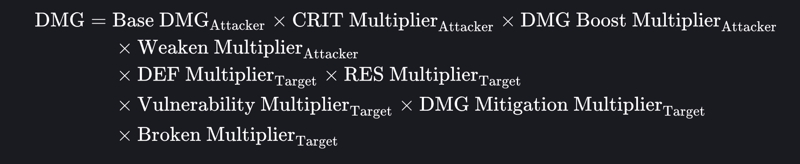
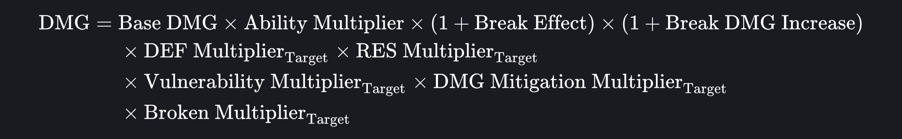
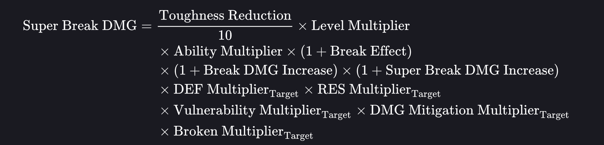
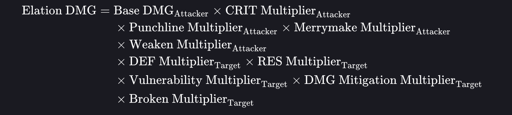

# Theorycraft Helper

TheoryCraftHelper is a damage calculator for the game **Honkai: Star Rail**.  
Its purpose is to reproduce the game's damage formulas to assist with theorycrafting, analysis, and damage estimation.

The calculator implements several combat damage equations including:

- Standard Damage
- Break Damage
- Super Break Damage
- Elation Damage

⚠ Disclaimer

- This project is **not affiliated with HoYoverse**.
- Character names, enemy names and formulas belong to HoYoverse.
- The calculator attempts to reproduce the in-game formulas as accurately as possible, but small differences may occur due to rounding or hidden internal values.

Observed differences between the calculator and the game are typically **below ~1%**.

---

# Standard Damage Formula

Standard damage corresponds to most attacks such as **Basic ATK, Skills, Ultimates, and Follow-Up Attacks**.

The formula combines several multipliers:

- Base Damage
- Critical Multiplier
- Damage Boost Multiplier
- Weaken Multiplier
- Defense Multiplier
- Resistance Multiplier
- Vulnerability Multiplier
- Damage Mitigation Multiplier
- Broken Multiplier

---

# Break Damage

Break damage occurs when an enemy's **Toughness bar reaches zero**.

Break damage depends mainly on:

- Ability Multiplier
- Break Element
- Target Toughness
- Break Effect
- Break Damage Increase
- Vulnerability modifiers
- Defense Multiplier
- Resistance Multiplier
- Damage Mitigation
- Broken Multiplier

Break damage **does not scale with ATK/HP/DEF** like standard attacks.

---

# Super Break Damage

Super Break damage is triggered by mechanics interacting with **weakness break and toughness reduction**.

Additional parameters include:

- Toughness Reduction
- Level Multiplier
- Ability Multiplier
- Break Effect
- Break Damage Increase
- Super Break Damage Increase
- Defense Multiplier
- Resistance Multiplier
- Vulnerability Multiplier
- Damage Mitigation Multiplier
- Broken Multiplier

---

# Elation Damage

Elation damage follows a special formula tied to **Elation mechanics**.

Additional multipliers include:

- Punchline Multiplier
- Merrymake Multiplier

Along with the usual combat multipliers:

- Base Damage
- Critical Multiplier
- Weaken Multiplier
- Defense Multiplier
- Resistance Multiplier
- Vulnerability Multiplier
- Damage Mitigation Multiplier
- Broken Multiplier

---

# Calculator Panels

The calculator UI separates the formula into several panels corresponding to the multipliers used in the formulas.

---

## Base Damage

Defines the base value of the attack using:

- Ability Multiplier
- Character scaling attribute
- Additional multipliers
- Flat extra damage

---

## Damage Boost Multiplier

Represents additive damage bonuses affecting the attack:

- Elemental Damage Bonus
- Generic Damage Bonus
- Conditional Damage Bonuses
- Damage over Time bonuses

All bonuses in this category are summed before being applied.

---

## Defense Multiplier

Represents the effect of enemy defense on damage.

It depends on:

- Enemy DEF
- DEF Reduction
- DEF Ignore
- Attacker Level

---

## Resistance Multiplier

Represents the target’s resistance to the attack element.

It includes:

- Elemental resistance
- Resistance penetration (RES PEN)

---

## Vulnerability Multiplier

Represents effects that increase the damage received by the enemy.

Includes:

- Element-specific vulnerability
- All-type vulnerability
- Break damage vulnerability

---

## Damage Mitigation Multiplier

Represents enemy damage reduction effects.

---

## Weaken Multiplier

Represents debuffs that increase the damage dealt to enemies.

---

## Critical Multiplier

Uses the attacker's:

- Crit Rate
- Crit Damage

to compute expected damage.

---

# Break Damage Panel

Allows calculating **Weakness Break damage**.

### Base Damage

Uses:

- Ability Multiplier
- Target Toughness
- Break Element

### Bonus Damage

Includes:

- Break Effect
- Break DMG Increase

### Vulnerability Multiplier

Includes:

- Element vulnerability
- All-type vulnerability
- Break damage vulnerability

---

# Super Break Damage Panel

Introduces a **Toughness Reduction calculation**.

### Toughness Reduction

Computed using:

- Base Toughness Reduction
- Additive Toughness Reduction
- Toughness Reduction Increase
- Weakness Break Efficiency
- Toughness Vulnerability

### Ability Multiplier

Scaling applied to the Super Break damage.

### Break Multiplier

Includes:

- Break Effect
- Break DMG Increase
- Super Break DMG Increase

---

# Elation Damage Panel

Computes damage related to **Elation mechanics**.

### Base Damage

Uses:

- Ability Multiplier
- Elation bonus

### Punchline Multiplier

Determined by:

- Certified Banger
- Punchline
- Punchline multiplier source

### Merrymake Multiplier

Additional multiplier based on the Merrymake stat.

---

# Damage Repartition Between Each Hit

Many abilities deal damage **multiple times**.

The calculator allows the damage to be distributed across **up to 10 hits**.

For each hit, the following parameters can be configured:

### Hit Multiplier

Defines the percentage of the ability's total damage assigned to the hit.

The sum of all hit multipliers should equal **100% of the ability multiplier**.

### Damage Type

Each hit can independently use a different damage calculation:

- Standard Damage
- Break Damage
- Super Break Damage
- Elation Damage

This allows modeling complex abilities that trigger multiple mechanics in a single attack.

### Critical Hit Control

Each hit can independently be set to **crit or not crit**, allowing precise simulation of damage outcomes.

### Additional Damage Mechanics

Hits can independently trigger:

- Break damage
- Super Break damage
- Elation damage

This allows reproducing advanced combat interactions.

### Damage Output

For each hit, the calculator displays the **resulting damage value** and allows copying it directly.

---

# Save System

The application allows saving the current values entered in the calculator.

Important behavior:

- Saved values are restored when reopening the application.
- Empty input fields are saved as **0**.

---

# Accuracy

The calculator aims to reproduce the damage formulas used in **Honkai: Star Rail** as accurately as possible.

Small discrepancies may occur due to:

- hidden decimal precision
- rounding differences
- unknown internal constants

Observed differences remain **below ~1% in tests**.

---

# Special Thanks

Thanks to the theorycrafting community for their research on the damage formulas.

---

# Project Status

This project is **not a final version**.

Future updates may include:

- improved UI
- additional combat mechanics
- improved formula precision
- support for future damage systems introduced in the game.